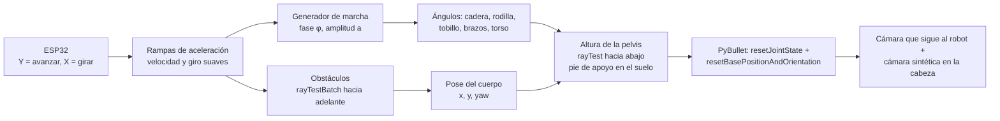

# Parte C — Consola ESP32 para que el robot Atlas camine por el laboratorio

> **Enunciado:** desarrollar una consola de mandos con la ESP32 para un
> movimiento fluido del robot que permita una movilidad real (imagen del robot
> Atlas en el *Bullet Physics ExampleBrowser* con las cámaras sintéticas RGB,
> Depth y Segmentation Mask).
> Repositorio base: https://github.com/erwincoumans/pybullet_robots (`atlas.py`)

← Volver al [README principal](../README.md)


## 1. Qué hace

- Reproduce la escena de `atlas.py`: el robot **Atlas** de Boston Dynamics
  sobre una caja azul, dentro del laboratorio **botlab**.
- **Modo CAMINAR:** con el joystick, Atlas **camina** hacia adelante y hacia
  atrás y **gira**, moviendo piernas y brazos de forma coordinada. Baja de la
  caja, pisa el suelo real del laboratorio y **se detiene frente a paredes,
  mesas y escalones** en vez de atravesarlos.
- **Modos de articulaciones:** con BTN2 se pasa a controlar articulaciones
  sueltas (brazos, piernas, torso y cabeza) y con BTN1 se cambia de postura.
- Muestra las **3 cámaras sintéticas** de una cámara montada en su cabeza, como
  en la imagen del enunciado, y la cámara de la ventana sigue al robot.


## 2. Cómo ejecutarlo

```bash
conda activate taller
cd atlas
python atlas_console.py --port COM7      # con ESP32
python atlas_console.py                  # sin ESP32 (teclado)
```

Si los paneles de las cámaras no aparecen, hacer clic en la ventana y pulsar **G**.
Con la rueda del mouse se hace zoom y con Ctrl + arrastrar se gira la vista; la
cámara sigue al robot conservando ese zoom y ese ángulo.

## 3. Controles

**Modo CAMINAR** (el modo con el que arranca):

| ESP32 | Teclado | Acción |
|---|---|---|
| Joystick Y | ↑ ↓ | Caminar adelante (hasta 0,6 m/s) / atrás (hasta 0,3 m/s) |
| Joystick X | ← → | Girar a la izquierda / derecha (hasta 0,9 rad/s) |
| **BTN1** | ESPACIO | Volver al punto de partida (encima de la caja) |
| **BTN2** | ENTER | Pasar al siguiente modo |

**Modos de articulaciones** (BTN2 los recorre en este orden y vuelve a Caminar):

| Modo | Joystick X | Joystick Y | Potenciómetro Z |
|---|---|---|---|
| Brazo izquierdo | `l_arm_shz` (hombro, girar) | `l_arm_shx` (hombro, subir/bajar) | `l_arm_elx` (codo) |
| Brazo derecho | `r_arm_shz` | `r_arm_shx` | `r_arm_elx` |
| Pierna izquierda | `l_leg_hpx` (cadera, abrir) | `l_leg_hpy` (cadera, adelante/atrás) | `l_leg_kny` (rodilla) |
| Pierna derecha | `r_leg_hpx` | `r_leg_hpy` | `r_leg_kny` |
| Torso y cabeza | `back_bkz` (girar torso) | `back_bky` (inclinar torso) | `neck_ry` (cabeza) |

En estos modos **BTN1** recorre las posturas: *Pose T* → *Brazos abajo* → *Saludo*.

## 4. Análisis y diseño

### 4.1 ¿Marcha dinámica o cinemática?

Hacer que un humanoide de 30 articulaciones camine con **física real**
(equilibrio dinámico, control del centro de presión, ZMP o aprendizaje por
refuerzo) es un problema de investigación: el propio `atlas.py` del repositorio
no camina, solo carga el robot quieto. Para el objetivo del taller (una
**consola que mueva al robot de forma fluida y realista**) se usa una
**marcha cinemática**, la misma técnica de la animación de personajes en
videojuegos y simuladores:

- Un **generador de marcha** calcula los ángulos de las articulaciones en cada instante.
- El **cuerpo** se desplaza según el joystick.
- La **percepción del entorno** (rayos) mantiene los pies sobre el suelo y
  evita atravesar objetos.



### 4.2 Movimiento del cuerpo

```python
speed += clip(target_speed − speed, ±ACCEL·dt)       # rampa: arranca y frena suave
yaw   += turn · dt
x     += speed · cos(yaw) · dt
y     += speed · sin(yaw) · dt
```

`target_speed = eje_Y × 0,6 m/s` (hacia atrás, × 0,3 m/s) y
`target_turn = −eje_X × 0,9 rad/s`. La aceleración se limita a 1,2 m/s², así
que Atlas no pasa de quieto a correr de golpe.

### 4.3 Generador de marcha

Una **fase** φ avanza con una frecuencia proporcional a la velocidad
(hasta 1,6 ciclos/s), y una **amplitud** a ∈ [0, 1] indica cuánto se está
caminando (también da pasos al girar en el sitio). Para cada pierna (la
derecha desfasada 180°, es decir φ + π):

| Articulación | Fórmula | Efecto |
|---|---|---|
| Cadera `hpy` | `−0,25 − 0,45·a·sin φ` | La pierna va adelante y atrás (negativo = adelante) |
| Rodilla `kny` | `0,5 + 0,75·a·max(0, cos φ)` | Se dobla más solo cuando la pierna avanza por el aire (fase de vuelo) |
| Tobillo `aky` | `−(hpy + kny)` | Compensa cadera y rodilla: **el pie queda paralelo al suelo** |
| Brazos `shz` | `0,5·a·sin φ` | Balanceo contrario a la pierna del mismo lado, como al caminar |
| Torso `bkz` | `−0,08·a·sin φ` | Leve giro del torso |

La postura base (`WALK_BASE`) tiene las rodillas un poco flexionadas y los
brazos abajo, como un humanoide real al caminar. Al caminar hacia atrás, la
fase avanza en sentido contrario. Cuando a = 0 (parado), todas las fórmulas
dan la postura base.

### 4.4 Contacto con el suelo

En cada ciclo (`_settle_height`):

1. Se lanza un rayo vertical (`rayTest`) bajo **cada pie**, desde la altura de
   la rodilla, para medir la altura del suelo.
2. Se compara con la parte inferior de los pies (`getAABB`).
3. Se corrige la altura de la pelvis para que **el pie más bajo (el de apoyo)
   toque el suelo**:
   - si el pie está enterrado, sube (máximo 2 cm por ciclo);
   - si está en el aire (por ejemplo, al salir de la caja), **cae con
     gravedad** (9,81 m/s²).

Resultado medido: sobre el piso, el pie de apoyo queda a **±1 mm** del suelo y
el pie en vuelo se levanta hasta ~25 cm.

El rayo empieza en la **rodilla** y no en la pelvis: en una primera versión
empezaba en la pelvis, chocaba con el tablero de una mesa y Atlas "se subía"
a la mesa.

### 4.5 Detección de obstáculos

Antes de avanzar (`_blocked`), se lanza una **malla de 21 rayos** hacia
adelante (o hacia atrás, si retrocede) con `rayTestBatch`: 7 alturas (de la
rodilla a la cabeza) × 3 posiciones a lo ancho del cuerpo (−30, 0 y +30 cm),
con un alcance de 45 cm. Si alguno choca con algo, o si el suelo de adelante
está más de 20 cm por encima (un escalón demasiado alto, como la otra caja
azul), la velocidad objetivo pasa a 0 y Atlas se detiene. Sí puede **bajar**
escalones, que es como sale de la caja inicial.

Para que los rayos no detecten al propio Atlas, se desactivan sus colisiones
(`setCollisionFilterGroupMask(..., 0, 0)`). Esto es correcto porque el robot se
mueve cinemáticamente.

### 4.6 Movimiento fluido de las articulaciones

Todas las articulaciones siguen su objetivo con **velocidad limitada**
(`q += clip(objetivo − q, ±v·dt)`): 6 rad/s mientras camina y 3 rad/s en los
modos manuales. Así, al cambiar de postura o de modo, el robot se mueve
suavemente hasta la nueva posición en lugar de saltar. Los objetivos se
limitan a los **límites reales** de cada articulación del URDF.

### 4.7 Cámaras

- **Cámara de la ventana:** cada 4 ciclos se lee su zoom y su ángulo
  (`getDebugVisualizerCamera`) y se recoloca apuntando a Atlas
  (`resetDebugVisualizerCamera`), así sigue al robot sin quitarle el control
  del mouse al usuario.
- **Cámara sintética:** cada 8 ciclos se construye una cámara en el link
  `head` (sensor MultiSense), mirando hacia donde mira la cabeza
  (`computeViewMatrix` a partir de la orientación del link, 70° de campo de
  visión), y se renderiza con `getCameraImage(320, 200, ...)`. PyBullet muestra
  el resultado en los paneles **RGB**, **Depth** (profundidad) y
  **Segmentation Mask** (un color por objeto), igual que en el ExampleBrowser.

## 5. Explicación del código (`atlas_console.py`)

| Elemento | Qué hace |
|---|---|
| Constantes | Velocidades, aceleración, frecuencia y amplitud de la marcha, altura máxima de escalón, distancia a obstáculos |
| `WALK_BASE`, `GROUPS`, `POSES` | Postura para caminar, modos de articulaciones y posturas predefinidas |
| `load_scene()` | Igual que `atlas.py`: carga Atlas, el botlab (rotando sus piezas del eje Y al Z) y las dos cajas |
| `AtlasConsole.__init__` | Conecta PyBullet, activa los paneles de cámara, carga la escena, desactiva las colisiones de Atlas y lee nombres y límites de las 30 articulaciones |
| `reset_position()` | Devuelve a Atlas al punto de partida (BTN1 en modo Caminar) |
| `_ray_down()` | Altura del suelo bajo un punto |
| `_knee_z()` | Altura desde la que se busca el suelo |
| `_blocked()` | Detección de obstáculos y escalones (sección 4.5) |
| `_gait()` | Movimiento del cuerpo + generador de marcha (secciones 4.2 y 4.3) |
| `_settle_height()` | Contacto de los pies con el suelo (sección 4.4) |
| `step(state)` | Un ciclo: botones → marcha o modo manual → articulaciones suaves → pose del cuerpo → altura → física → cámaras y textos |
| `_follow_camera()` | Cámara de la ventana que sigue al robot |
| `_update_text()` | Texto sobre Atlas con el modo y la velocidad |
| `render_head_camera()` | Cámara sintética de la cabeza |
| `main()` | Crea `SerialConsole(default_mode="B")` y la simulación, y corre el ciclo a 240 Hz |

## 6. Pruebas realizadas

| Prueba | Resultado |
|---|---|
| Caminar adelante desde la caja | Baja de la caja (z −1,5 → −2,0 m) y camina a 0,6 m/s |
| Caminar hacia la otra caja azul | Se detiene antes (escalón de 50 cm > 20 cm) |
| Caminar hacia una mesa | Se detiene antes de tocarla |
| Contacto pie-suelo sobre el piso | ±1 mm (pie de apoyo); el pie en vuelo sube hasta 25 cm |
| Rango de la cadera durante la marcha | −0,70 a +0,20 rad |
| Girar en el sitio | ~0,9 rad/s dando pasos |
| BTN1 en modo Caminar | Vuelve al punto de partida |
| Modo brazo izquierdo, joystick Y 1 s | El hombro se mueve 1,2 rad |
| Cámara sintética | Imagen RGB + profundidad + segmentación de 320×200 |

## 7. Posibles mejoras

- Marcha dinámica real con un controlador de equilibrio (ZMP) o una política
  entrenada con aprendizaje por refuerzo.
- Paso lateral con el potenciómetro.
- Agarrar objetos del laboratorio con las manos de Atlas.
