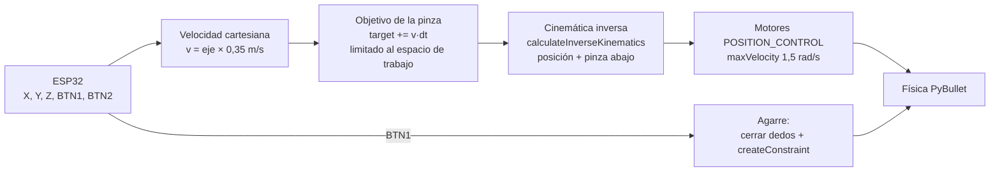

# Parte B — Consola ESP32 para el robot Baxter (posicionamiento + coger y mover un objeto)

> **Enunciado:** desarrollar una consola de mandos con la ESP32 para un
> movimiento fluido del robot Baxter que permita una movilidad real de brazos y
> posicionamiento, además de que el robot pueda coger y mover un objeto.
> Repositorio base: https://github.com/erwincoumans/pybullet_robots (`baxter_ik_demo.py`)

← Volver al [README principal](../README.md)


## 1. Qué hace

- Carga el robot **Baxter** (Rethink Robotics, 2 brazos de 7 grados de libertad)
  del repositorio `pybullet_robots`, frente a una **mesa** con un **cubo verde**
  (el objeto) y un **cuadro rojo** (la zona destino).
- El ESP32 mueve la **pinza** en el espacio (adelante/atrás, izquierda/derecha,
  arriba/abajo) y la **cinemática inversa (IK)** calcula en cada instante los
  ángulos de las 7 articulaciones del brazo para llegar ahí, con la pinza siempre
  apuntando hacia abajo.
- **BTN1** cierra la pinza: si está cerca del cubo, lo agarra; al volver a
  presionarlo, lo suelta y el cubo cae con física real.
- **BTN2** cambia entre el brazo **izquierdo** y el **derecho**.

## 2. Cómo ejecutarlo

```bash
conda activate taller
cd baxter
python baxter_ik_teleop.py --port COM7    # con ESP32
python baxter_ik_teleop.py                # sin ESP32 (teclado)
```

Requiere el repositorio `pybullet_robots` clonado en la carpeta del taller: el
modelo se carga desde `pybullet_robots/data/baxter_common/baxter_description/urdf/toms_baxter.urdf`.

Con ESP32, la consola muestra cada segundo lo que llega y dónde está la pinza
(sirve para diagnosticar):

```
ESP32 -> X=+0.85 Y=+0.00 Z=+0.00 BTN1=0 BTN2=0   pinza en [0.71 0.3  0.05]
```

Los mismos valores aparecen arriba en la ventana.

## 3. Controles y tarea

| ESP32 | Teclado | Acción |
|---|---|---|
| Joystick X | ← → | Pinza adelante / atrás |
| Joystick Y | ↑ ↓ | Pinza izquierda / derecha |
| Potenciómetro | RePág / AvPág | Pinza arriba / abajo |
| **BTN1** | ESPACIO | Cerrar pinza (agarrar) / abrir (soltar) |
| **BTN2** | ENTER | Cambiar de brazo |

**Tarea demostrativa (coger y mover):**

1. Llevar el texto rojo **TARGET** (objetivo de la pinza) encima del cubo verde.
2. Bajar la pinza con el potenciómetro hasta el cubo.
3. **BTN1** → en la consola: `Objeto agarrado (distancia 0.021 m)`.
4. Subir, llevar el cubo sobre el cuadro rojo y bajarlo.
5. **BTN1** → `Pinza abierta: objeto liberado.` El cubo queda en la zona destino.

## 4. Análisis y diseño

### 4.1 Del demo original a una consola

El demo `baxter_ik_demo.py` del repositorio mueve el brazo con **sliders** de
la GUI y "teletransporta" las articulaciones (`resetJointState`) a la solución
de la IK en cada cuadro. Para una consola real se cambió:

| Demo original | Esta versión | Por qué |
|---|---|---|
| Objetivo con sliders | Objetivo con el joystick como **velocidad** | Control intuitivo: la pinza se mueve mientras el joystick está inclinado y se queda quieta al soltarlo |
| `resetJointState` (teletransporte) | **Motores** con control de posición y velocidad máxima | Movimiento **fluido y físico**; el brazo interactúa con el cubo y la mesa |
| IK sin orientación | IK con **pinza hacia abajo** | Postura realista para agarrar objetos de una mesa |
| Límites falsos (±2 rad) | **Límites reales** del URDF + postura de reposo | Posturas naturales, sin giros imposibles |
| Robot rotado a mano, objetivos inalcanzables | Robot en el origen mirando a +X, objetivos dentro del alcance | Con los valores originales la IK no llegaba al objetivo (errores de ~85 cm) |
| Sin objeto | Mesa, cubo, zona destino y agarre | Requisito "coger y mover un objeto" |

### 4.2 Flujo de control



### 4.3 Cinemática inversa (IK)

La **cinemática directa** responde: "con estos ángulos, ¿dónde queda la pinza?".
La **inversa** responde lo contrario: "quiero la pinza *aquí*, ¿qué ángulos
necesito?". PyBullet la resuelve numéricamente (método iterativo con el
jacobiano) con:

```python
q = p.calculateInverseKinematics(
        robot, ee_link, target_pos, GRIPPER_DOWN,          # posición + orientación
        lowerLimits=ll, upperLimits=ul, jointRanges=jr,    # límites reales del URDF
        restPoses=rest, maxNumIterations=100, residualThreshold=1e-4)
```

- **Efector final:** link 48 `left_endpoint` (brazo izquierdo) o 26
  `right_endpoint` (brazo derecho): el punto entre los dedos de la pinza.
- **Orientación** `GRIPPER_DOWN` = rotación de 180° en X: la pinza apunta al suelo.
- **Redundancia (espacio nulo):** cada brazo tiene 7 articulaciones y la tarea
  solo necesita 6 (3 de posición + 3 de orientación), así que hay infinitas
  soluciones. `restPoses` le dice a la IK que prefiera la más parecida a una
  postura natural (codo doblado); así se evitan posturas raras.
- La IK devuelve ángulos para **todas** las articulaciones del robot; solo se
  aplican las del brazo activo (`left_*` o `right_*`), y el otro brazo se queda
  quieto.
- Se resuelve **una vez por ciclo** partiendo de la postura actual. Como el
  objetivo se mueve poco entre ciclos, la solución converge rápido y es continua.

### 4.4 Movimiento fluido

1. **Joystick como velocidad:** `target += eje × 0,35 m/s × dt`. El objetivo
   cambia de forma continua, nunca a saltos.
2. **`dt` real:** se usa el tiempo real transcurrido entre ciclos. Con la
   ventana abierta el programa corre a ~115 ciclos/s en lugar de 240, y sin esta
   corrección la pinza iba a la mitad de velocidad. La física se avanza con 1 a
   4 sub-pasos de 1/240 s para mantenerse en tiempo real.
3. **Motores con velocidad máxima:** `setJointMotorControl2(POSITION_CONTROL,
   force=200, maxVelocity=1.5, positionGain=0.3)`. Aunque la IK pida un cambio
   grande, las articulaciones giran a 1,5 rad/s como máximo.
4. **Espacio de trabajo:** el objetivo se limita a la caja `WS_MIN`–`WS_MAX`
   (sobre la mesa y al alcance del brazo). Así el brazo nunca intenta llegar a un
   punto imposible, que es lo que produce movimientos bruscos.

### 4.5 Agarre del objeto

Simular el agarre solo con fricción entre dos dedos es muy inestable en PyBullet
(el objeto resbala o "salta"). Se usa la técnica habitual en robótica simulada:
una **restricción fija** (`createConstraint` tipo `JOINT_FIXED`) entre la pinza
y el cubo.

```python
# pose del cubo expresada en el sistema de la pinza (para que no "salte" al agarrar)
inv_pos, inv_orn = p.invertTransform(ee_pos, ee_orn)
rel_pos, rel_orn = p.multiplyTransforms(inv_pos, inv_orn, cube_pos, cube_orn)
cid = p.createConstraint(robot, ee_link, cube, -1, p.JOINT_FIXED, [0,0,0],
                         rel_pos, [0,0,0], parentFrameOrientation=rel_orn)
p.changeConstraint(cid, maxForce=200)
```

- Solo se agarra si la pinza está a menos de `GRASP_DISTANCE = 7 cm` del cubo;
  si no, se cierra la pinza y la consola dice a qué distancia está.
- Se calcula la **pose relativa** cubo-pinza en el momento del agarre y la
  restricción la conserva: el cubo queda exactamente donde estaba respecto a la
  pinza.
- Los **dedos** se cierran y abren visualmente (articulaciones prismáticas de
  0 a 2 cm).
- Al soltar se elimina la restricción (`removeConstraint`) y el cubo cae con
  gravedad y fricción reales sobre la mesa.

## 5. Explicación del código (`baxter_ik_teleop.py`)

| Elemento | Qué hace |
|---|---|
| Constantes | `MOVE_SPEED`, `GRASP_DISTANCE`, posición del cubo (`CUBE_START`), zona destino (`DROP_ZONE`), espacio de trabajo (`WS_MIN/WS_MAX`), links de cada brazo (`ARMS`), postura de reposo (`REST`) |
| `BaxterTeleop.__init__` | Conecta PyBullet, carga suelo, Baxter, mesa (caja creada con `createMultiBody`), cubo y zona destino. Lee límites de las articulaciones, calcula la postura de reposo (el brazo derecho es el espejo del izquierdo) y coloca los dos brazos sobre la mesa |
| `_solve_ik(arm)` | IK del brazo indicado; guarda la solución en `self.cmd` solo para las articulaciones de ese brazo |
| `_apply_motors()` | Envía `self.cmd` a los motores (excepto los dedos) |
| `_set_fingers_all()` | Abre o cierra los dedos de ambas pinzas según `grip_closed` |
| `ee_pos()` | Posición actual de la pinza activa |
| `toggle_grip()` | Lógica de BTN1: soltar si tiene el cubo; si no, cerrar y agarrar si está cerca |
| `step(state, dt)` | Un ciclo: botones → mover el objetivo → IK → motores → física → textos en pantalla |
| `_update_text()` | Texto **TARGET** en el objetivo y línea de estado con el brazo, el objeto y los valores del ESP32 |
| `main()` | Crea `SerialConsole(default_mode="B")` y la simulación, y corre el ciclo midiendo el `dt` real; imprime el diagnóstico cada segundo |

## 6. Pruebas realizadas

Prueba automática (entradas de joystick simuladas por código, brazo izquierdo):

| Paso | Error de posición de la pinza |
|---|---|
| Sobre el cubo (15 cm arriba) | 1,3 cm |
| Bajar hasta el cubo | 2,1 cm → `Objeto agarrado (distancia 0.021 m)` |
| Subir con el cubo | 1,3 cm |
| Llevarlo sobre la zona destino | 0,3 cm |
| Bajar y soltar | 0,2 cm |
| **Posición final del cubo** | `(0.565, 0.444)`; centro de la zona `(0.55, 0.45)` → **1,6 cm** del centro |
| Cambiar al brazo derecho y moverlo | 0,3 cm |

Alcance: el brazo izquierdo trabaja en la mitad izquierda de la mesa (y > -0,1 m)
y el derecho en la mitad derecha. Para pasar el cubo al otro lado se puede
soltar en el centro y recogerlo con el otro brazo.

## 7. Solución de problemas

| Síntoma | Causa / solución |
|---|---|
| `ESP32 -> X=+0.00 Y=+0.00` aunque se mueva el joystick | El ESP32 no lee el joystick: revisar el cableado con `esp32_console/prueba_joystick` |
| Z cambia pero X/Y no | Igual que el anterior: el potenciómetro está bien y el joystick no (alimentación 3V3/GND o pines 34/35) |
| `Pinza cerrada, pero el cubo está a 0.12 m` | Acercar más la pinza (bajar hasta tocar el cubo) y volver a presionar BTN1 |
| El brazo no llega a un punto | Está fuera del espacio de trabajo o del alcance de ese brazo: usar el otro brazo (BTN2) |
| `ERROR: no se pudo abrir COM7` | Cerrar el Monitor Serie del Arduino IDE |
