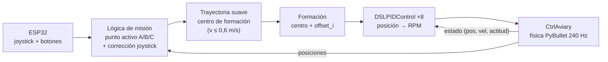

# Parte A — Drones de A → B → C controlados desde el ESP32

> **Enunciado:** mover los drones de un lugar A a un lugar B y a un lugar C,
> teniendo presente que el control se gestionará desde la ESP32.
> Repositorio base: https://github.com/utiasDSL/gym-pybullet-drones

← Volver al [README principal](../README.md)


## 1. Qué hace

- Crea un **enjambre de 8 drones** Crazyflie 2.x (`CF2X`) en el escenario del
  repositorio, con obstáculos (pato, esfera, cubo y estadio), como en las
  imágenes del enunciado.
- Los drones despegan del suelo y vuelan **en formación circular** por los
  puntos **A** (verde), **B** (azul) y **C** (rojo), que se dibujan en la simulación.
- **El ESP32 gestiona la misión:** avanza de un punto al siguiente, activa o
  desactiva el modo automático y corrige la ruta en vivo con el joystick y el
  potenciómetro.
- Guarda un registro de vuelo (`flight_log.csv`) que se puede graficar como
  evidencia con `plot_flight_log.py`.

## 2. Cómo ejecutarlo

```bash
conda activate taller
cd drones
python drone_control.py --port COM7       # con ESP32
python drone_control.py                   # sin ESP32 (teclado)
```

| Opción | Por defecto | Descripción |
|---|---|---|
| `--port` | ninguno | Puerto del ESP32 (`COM7`). Sin él se usa el teclado |
| `--num_drones` | 8 | Cantidad de drones (usar 4 si el PC va lento) |
| `--auto` | `True` | Recorrer A → B → C solo. `--auto False` = solo avanza con BTN1 |
| `--obstacles` | `True` | Mostrar el pato, la esfera, etc. |
| `--gui` | `True` | `False` = sin ventana (pruebas rápidas) |
| `--duration` | 0 | Segundos de simulación (0 = hasta cerrar la ventana) |

Para generar la gráfica de la trayectoria después de volar:

```bash
python plot_flight_log.py            # guarda ../docs/img/trayectoria_drones.png
python plot_flight_log.py --show     # y además la muestra en pantalla
```

## 3. Controles

| ESP32 | Teclado | Acción |
|---|---|---|
| Joystick X | ← → | Desplaza la formación en X |
| Joystick Y | ↑ ↓ | Desplaza la formación en Y |
| Potenciómetro | RePág / AvPág | Sube / baja la formación (entre 0,3 y 3 m) |
| **BTN1** | ESPACIO | Ir al siguiente punto: A → B → C → A … |
| **BTN2** | ENTER | Modo automático ON / OFF |

Arriba de la escena se muestra el estado: `Destino: B | auto: OFF | ESP32`.

## 4. Análisis y diseño

### 4.1 ¿Por qué `CtrlAviary` + `DSLPIDControl`?

Volar un cuadricóptero exige calcular, cientos de veces por segundo, las
**RPM de cada uno de los 4 motores** para mantenerlo estable. El repositorio
`gym-pybullet-drones` ya trae resuelto ese control de bajo nivel:

- `CtrlAviary`: el entorno de simulación (física de PyBullet, modelo de empuje
  y torque de las hélices, efecto suelo, arrastre).
- `DSLPIDControl`: el controlador PID en cascada del *Dynamic Systems Lab*
  (el mismo del ejemplo oficial `examples/pid.py`). Recibe el estado del dron
  y una **posición objetivo**, y devuelve las RPM de los motores.

Nuestro trabajo es de **alto nivel**: decidir, en cada instante, **a qué
posición debe ir cada dron**. Es la misma separación que en un dron real: el
piloto (aquí el ESP32) decide a dónde ir y el autopiloto estabiliza.



### 4.2 Frecuencias

- Física: `pyb_freq = 240 Hz` (paso de integración de PyBullet).
- Control: `ctrl_freq = 48 Hz` → cada `env.step()` avanza 5 pasos de física.
- ESP32: 50 Hz, leído por el hilo de `serial_bridge`.
- `sync()` del repositorio mantiene la simulación en **tiempo real** cuando hay ventana.

### 4.3 Formación

`formation_offsets(n, radius)` reparte los `n` drones en un círculo de radio
0,45 m alrededor de un **centro de formación**:

```python
offset_i = [r·cos(2πi/n), r·sin(2πi/n), 0]
objetivo_i = centro + offset_i
```

Así solo hay que mover **un punto** (el centro) y todos los drones lo siguen
manteniendo la forma y la distancia entre ellos (~35 cm), sin chocar.

### 4.4 Trayectoria suave (el punto clave)

Si se le diera al PID directamente el punto B, que está a más de 2 m, el
error sería enorme, los drones acelerarían al máximo y se inclinarían
bruscamente, con riesgo de chocar entre sí. Por eso el centro de formación
**no salta** al punto destino: avanza hacia él con una velocidad máxima de
`CRUISE_SPEED = 0,6 m/s`:

```python
delta = goal - center
dist = ||delta||
center = goal                                  si dist ≤ v·dt
center = center + delta/dist · v·dt            en otro caso
```

Es un **generador de trayectoria rectilínea con velocidad limitada**. El PID
solo tiene que corregir errores pequeños, y el vuelo es estable y fluido.

### 4.5 Llegada a cada punto

Se calcula el **error medio** entre la posición real de cada dron y su lugar
en la formación alrededor del punto destino:

```python
err = mean_i || pos_i − (goal + offset_i) ||
```

Si `err < 0,12 m`, la formación llegó. En **modo automático** espera
`HOLD_TIME = 2 s` (tiempo simulado) y pasa al siguiente punto. En **modo
manual** se queda en el punto hasta que se presione **BTN1**.

### 4.6 Corrección con el joystick

Mientras el joystick está inclinado, el punto destino se desplaza a
`JOYSTICK_SPEED = 0,8 m/s × valor del eje`. La altura se limita entre 0,3 m y
3 m para que la formación no toque el suelo. Como el centro de formación sigue
al destino con velocidad limitada, la respuesta al joystick también es suave.

## 5. Explicación del código (`drone_control.py`)

| Bloque | Qué hace |
|---|---|
| Encabezado e imports | Importa `SerialConsole` desde `../common`, y `CtrlAviary`, `DSLPIDControl`, `sync` del repositorio. Si falta algo, muestra cómo instalarlo |
| `WAYPOINTS` | Coordenadas de A `(0, 0, 1)`, B `(1.5, 1.5, 1.3)` y C `(-1.5, 1.5, 0.8)` en metros. **Aquí se cambian los puntos** |
| Constantes | Radio de formación, velocidades, umbral de llegada, tiempo de espera |
| `formation_offsets()` | Posiciones relativas de los drones en el círculo |
| `draw_waypoints()` | Dibuja un poste y una letra para cada punto, y líneas grises entre ellos |
| `main()` → configuración | Lee los argumentos, crea `SerialConsole(default_mode="D")`, el entorno con `n` drones en el suelo y un PID por dron |
| Ciclo → entrada | `console.read()`: BTN2 alterna el modo automático, BTN1 avanza el punto y el joystick desplaza el destino |
| Ciclo → trayectoria | Avanza el centro de formación hacia el destino (sección 4.4) |
| Ciclo → física y control | `env.step(action)` simula; para cada dron `computeControlFromState()` calcula las RPM del siguiente paso |
| Ciclo → llegada | Error medio y cambio automático de punto (sección 4.5) |
| Ciclo → registro | Una fila por paso en `flight_log.csv`: `t, waypoint, cx, cy, cz, x0, y0, z0, …` |
| `finally` | Cierra el archivo, el puerto serie y el entorno, aunque se cierre con Ctrl+C |

### `plot_flight_log.py`

Lee `flight_log.csv` y genera dos gráficas:

- **3D:** trayectoria de cada dron, centro de formación (línea punteada) y puntos A, B, C.
- **Tiempo:** posición promedio real vs. comandada en x, y, z. El seguimiento
  del PID se ve como el retraso entre las dos curvas.


## 6. Pruebas realizadas

Prueba automática sin ventana (`--gui False --duration 25`, modo automático):

| Evento | Resultado |
|---|---|
| Despegue y llegada a A | error medio 0,119 m |
| Llegada a B | error medio 0,112 m |
| Llegada a C | error medio 0,112 m |
| Error de cada dron en reposo sobre un punto | 1-5 cm |
| Error durante el desplazamiento (0,6 m/s) | ~20 cm (retraso normal del PID) |

## 7. Posibles mejoras

- Rutas curvas (splines) en vez de rectas entre puntos.
- Diferentes formaciones (línea, V) seleccionables con BTN2.
- Evitar obstáculos con un planificador (A*, campos potenciales).
