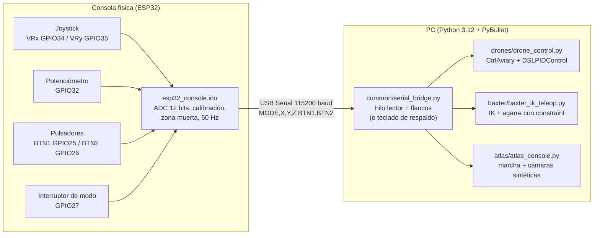
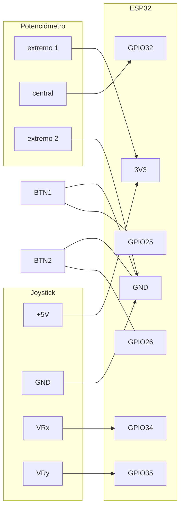

# Taller Segundo Corte — Real-to-Sim con ESP32 + PyBullet

Práctica de **real-to-sim**: una consola de mandos física construida con un
**ESP32** (joystick, potenciómetro y pulsadores) controla en tiempo real
robots simulados en **PyBullet**. El mismo hardware y el mismo firmware sirven
para las tres partes del taller; lo único que cambia es el script de Python
que se ejecuta en el PC.

| Parte | Enunciado | Solución | Documentación |
|:---:|---|---|---|
| **A** | Mover los drones de un lugar A a un lugar B y a un lugar C, con el control gestionado desde el ESP32 | Enjambre de 8 drones en formación circular que vuela A → B → C con control PID; el ESP32 avanza los puntos, activa el modo automático y corrige la ruta | [`drones/README.md`](drones/README.md) |
| **B** | Consola de mandos con ESP32 para un movimiento fluido del robot Baxter, con movilidad real de brazos y posicionamiento, y que pueda coger y mover un objeto | Teleoperación cartesiana de los dos brazos con cinemática inversa, pinza que agarra un cubo y lo lleva a una zona destino | [`baxter/README.md`](baxter/README.md) |
| **C** | Consola de mandos con ESP32 para un movimiento fluido de un robot con movilidad real (Atlas, repo `pybullet_robots`) | Atlas camina por el laboratorio *botlab* (marcha cinemática con contacto con el suelo y detección de obstáculos), mueve articulaciones sueltas y muestra cámaras sintéticas RGB / Depth / Segmentación | [`atlas/README.md`](atlas/README.md) |

Documentación de las piezas compartidas:

- [`esp32_console/README.md`](esp32_console/README.md): firmware del ESP32, conexiones y programas de diagnóstico.
- [`common/README.md`](common/README.md): puente serie ESP32 ↔ Python (protocolo, hilo lector, detección de pulsaciones, modo teclado).
- [`docs/README.md`](docs/README.md): cómo agregar los videos y las imágenes de evidencia.

<p align="center">
  
  
  
</p>

---

## Tabla de contenido

1. [Arquitectura](#1-arquitectura)
2. [Estructura del repositorio](#2-estructura-del-repositorio)
3. [Materiales y conexiones](#3-materiales-y-conexiones)
4. [Instalación paso a paso](#4-instalación-paso-a-paso)
5. [Ejecución rápida](#5-ejecución-rápida)
6. [Evidencia (videos)](#6-evidencia-videos)
7. [Problemas encontrados y cómo se resolvieron](#7-problemas-encontrados-y-cómo-se-resolvieron)
8. [Solución de problemas](#8-solución-de-problemas)
9. [Referencias](#9-referencias)

---

## 1. Arquitectura



**Idea central:** el ESP32 **no sabe nada de la simulación**. Solo mide sus
entradas, las normaliza y las envía como una línea de texto 50 veces por
segundo. Cada script de Python interpreta esa misma información a su manera:

| Entrada del ESP32 | Drones (A) | Baxter (B) | Atlas (C) |
|---|---|---|---|
| Joystick X | Mover formación en X | Pinza adelante/atrás | Girar |
| Joystick Y | Mover formación en Y | Pinza izquierda/derecha | Caminar adelante/atrás |
| Potenciómetro Z | Subir/bajar formación | Subir/bajar pinza | (articulaciones) |
| BTN1 | Siguiente punto A→B→C | Agarrar/soltar | Volver al inicio / postura |
| BTN2 | Modo automático on/off | Cambiar de brazo | Cambiar de modo |

**Protocolo serie** (detallado en [`common/README.md`](common/README.md)):

```
MODE,X,Y,Z,BTN1,BTN2\n          ejemplo:  D,0.00,-0.53,0.12,0,1
```

Separar el hardware de la simulación tiene tres ventajas:

1. **Un solo firmware** para las tres partes.
2. **Todos los scripts funcionan sin ESP32** (modo teclado), así la simulación
   se puede desarrollar y probar sin el hardware.
3. Si se cambia el hardware (otro joystick, otros pines), no hay que tocar Python.

## 2. Estructura del repositorio

```
Taller-Segundo-Corte/
├── README.md                     ← este archivo
├── requirements.txt              ← dependencias de Python
├── .gitignore
├── esp32_console/
│   ├── README.md
│   ├── esp32_console.ino         ← firmware único para las 3 partes
│   ├── prueba_botones/           ← diagnóstico de pulsadores
│   └── prueba_joystick/          ← diagnóstico del joystick (valores crudos del ADC)
├── common/
│   ├── README.md
│   └── serial_bridge.py          ← lectura del Serial (o teclado)
├── drones/
│   ├── README.md
│   ├── drone_control.py          ← Parte A
│   └── plot_flight_log.py        ← gráfica de la trayectoria (evidencia)
├── baxter/
│   ├── README.md
│   └── baxter_ik_teleop.py       ← Parte B
├── atlas/
│   ├── README.md
│   └── atlas_console.py          ← Parte C
├── docs/
│   ├── README.md                 ← cómo subir la evidencia
│   └── img/                      ← capturas y gráficas
├── gym-pybullet-drones/          ← (se clona, no se sube: ver .gitignore)
└── pybullet_robots/              ← (se clona, no se sube: ver .gitignore)
```

> Las carpetas `gym-pybullet-drones/` y `pybullet_robots/` son repositorios de
> terceros (134 MB y 415 MB). No se suben a este repositorio: se clonan en la
> instalación (sección 4). Los scripts las buscan en esa ubicación exacta.

## 3. Materiales y conexiones

| Cantidad | Componente |
|:---:|---|
| 1 | ESP32 DevKit (chip USB CP210x) |
| 1 | Módulo joystick analógico de 2 ejes (KY-023 o similar) |
| 1 | Potenciómetro de 10 kΩ (eje Z) |
| 2 | Pulsadores de 4 patas |
| 1 | Interruptor o cable para el modo (opcional) |
| 1 | Protoboard y cables jumper |
| 1 | Cable USB de datos |

| Elemento | Pin del ESP32 |
|---|---|
| Joystick **VRx** | GPIO34 |
| Joystick **VRy** | GPIO35 |
| Joystick **+5V** | **3V3** (el ADC del ESP32 es de 3,3 V) |
| Joystick **GND** | GND |
| Potenciómetro, pin central | GPIO32 (extremos a 3V3 y GND) |
| BTN1 (pata en diagonal a GND) | GPIO25 |
| BTN2 (pata en diagonal a GND) | GPIO26 |
| Interruptor de modo a GND (opcional) | GPIO27 |



Los detalles (resistencias pull-up internas, calibración, errores de cableado
típicos) están en [`esp32_console/README.md`](esp32_console/README.md).

## 4. Instalación paso a paso

Probado en **Windows 11** con **Miniconda**, Python 3.12 y PyBullet 3.25.

### 4.1 Clonar este repositorio y los repositorios externos

```bash
git clone https://github.com/<tu-usuario>/Taller-Segundo-Corte.git
cd Taller-Segundo-Corte
git clone https://github.com/utiasDSL/gym-pybullet-drones.git
git clone https://github.com/erwincoumans/pybullet_robots.git
```

### 4.2 Crear el entorno de Python

Abrir **Anaconda Prompt** dentro de la carpeta del repositorio:

```bash
conda create -n taller -c conda-forge python=3.12 pybullet "libblas=*=*openblas" -y
conda activate taller
pip install -r requirements.txt
cd gym-pybullet-drones
pip install -e . --no-deps
cd ..
```

¿Por qué así?

- `gym-pybullet-drones` exige **Python ≥ 3.12**.
- `pybullet` se instala desde **conda-forge** porque en Windows `pip` intenta
  compilarlo y necesita Visual Studio.
- `"libblas=*=*openblas"` obliga a NumPy a usar **OpenBLAS** en lugar de MKL:
  con MKL, en este PC Python se cerraba sin mensaje (código `0xc06d007f`)
  al llamar `numpy.linalg.inv`, que usan los drones al arrancar.
- `--no-deps` evita que pip instale `torch` y `stable-baselines3`: solo sirven
  para el aprendizaje por refuerzo de ese repositorio y aquí no se usan.

Comprobar la instalación:

```bash
python -c "import pybullet, numpy, serial, transforms3d, gym_pybullet_drones; print('OK')"
```

### 4.3 Cargar el firmware en el ESP32

1. Arduino IDE → *Gestor de tarjetas* → instalar **esp32** (Espressif Systems).
2. Abrir `esp32_console/esp32_console.ino`.
3. *Herramientas → Placa →* **ESP32 Dev Module**; *Puerto →* el COM del ESP32
   (en este PC, **COM7**, "Silicon Labs CP210x").
4. **Subir**. Si se queda en `Connecting...`, mantener pulsado **BOOT**.
5. Abrir el Monitor Serie a **115200** y comprobar que salen líneas como
   `D,0.00,0.00,0.00,0,0`.
6. **Cerrar el Monitor Serie** antes de ejecutar Python: solo un programa puede
   usar el puerto a la vez.

## 5. Ejecución rápida

Siempre con el entorno activado (`conda activate taller`), desde la carpeta del
repositorio. Sin `--port`, todos los scripts se controlan con el teclado.

| Parte | Comando con ESP32 | Sin ESP32 |
|---|---|---|
| A — Drones | `cd drones` → `python drone_control.py --port COM7` | `python drone_control.py` |
| B — Baxter | `cd baxter` → `python baxter_ik_teleop.py --port COM7` | `python baxter_ik_teleop.py` |
| C — Atlas | `cd atlas` → `python atlas_console.py --port COM7` | `python atlas_console.py` |

Teclado de respaldo (igual en las tres partes; hacer clic antes en la ventana de PyBullet):

| Tecla | Equivale a |
|---|---|
| Flechas ← → | Joystick X |
| Flechas ↑ ↓ | Joystick Y |
| RePág / AvPág (o U / J) | Potenciómetro Z |
| ESPACIO | BTN1 |
| ENTER (o B) | BTN2 |

## 6. Evidencia (videos)

Cada video debe mostrar **al mismo tiempo** la consola ESP32 (la mano moviendo
el joystick o los pulsadores) y la pantalla con la simulación, para que se vea
que el control es *real-to-sim*. En [`docs/README.md`](docs/README.md) se
explica cómo grabarlos y subirlos a GitHub.

### Parte A — Drones A → B → C


https://github.com/user-attachments/assets/2401e564-7084-493a-aa3a-2174f9723be6


Qué se ve en el video:

1. Despegue de los 8 drones y llegada al punto **A**.
2. Con **BTN2** se pasa a modo manual; con **BTN1** la formación va a **B**.
3. Corrección de la ruta con el joystick y el potenciómetro.
4. **BTN1** → la formación llega a **C**.

### Parte B — Baxter coge y mueve un objeto

<!-- Reemplaza la línea siguiente por el enlace de tu video -->
▶️ **Video:** _pendiente de agregar_

Qué se ve en el video:

1. El joystick lleva la pinza (texto **TARGET**) sobre el cubo verde.
2. El potenciómetro la baja; **BTN1** cierra la pinza (`Objeto agarrado`).
3. El cubo se lleva hasta el cuadro rojo y **BTN1** lo suelta.
4. **BTN2** cambia al brazo derecho.


### Parte C — Atlas camina por el laboratorio

Qué se ve en el video:

1. Atlas baja de la caja azul caminando hacia adelante.
2. Gira y camina por el laboratorio; se detiene frente a una mesa u obstáculo.
3. Paneles RGB / Depth / Segmentación de la cámara de su cabeza.
4. **BTN2** → modos de articulaciones (brazos, piernas, torso) y **BTN1** → posturas.


https://github.com/user-attachments/assets/89704068-4af8-44f1-9927-8c800ed5f9b8


## 7. Problemas encontrados y cómo se resolvieron

| Problema | Causa | Solución |
|---|---|---|
| `ModuleNotFoundError: transforms3d` al ejecutar los drones | Dependencia de `gym-pybullet-drones` que no estaba instalada | `pip install transforms3d scipy matplotlib` (incluido en `requirements.txt`) |
| Python se cerraba sin mensaje (código `0xc06d007f`) al crear el entorno de drones | La librería MKL de NumPy fallaba en `numpy.linalg.inv` | Cambiar NumPy a OpenBLAS: `conda install -c conda-forge "libblas=*=*openblas"` |
| Baxter no encontraba su modelo y la IK no llegaba al objetivo | El script original buscaba `baxter_common/` en la carpeta actual y usaba objetivos fuera del alcance del brazo | Rutas absolutas a `pybullet_robots/data`, objetivos dentro del espacio de trabajo y mesa a la altura correcta |
| En modo teclado Baxter ignoraba todas las teclas | El respaldo por teclado siempre reportaba el modo "D" | Cada script define su modo (`default_mode`) |
| El robot no respondía al ESP32 | El Monitor Serie del Arduino IDE tenía ocupado COM7 y el script pasaba en silencio al modo teclado | Ahora, si se usa `--port` y el puerto no abre, el script se detiene con un mensaje claro |
| Los pulsadores marcaban 1 siempre | Pulsador de 4 patas conectado en dos patas unidas internamente | Conectar GPIO y GND en patas en diagonal (`prueba_botones.ino`) |
| Un switch solo servía una vez | El programa solo reaccionaba al paso de 0 a 1 | Si el botón pasa más de 1 s en 1, se trata como switch y bajarlo también cuenta |
| Con la ventana abierta Baxter se movía a la mitad de velocidad | El movimiento se calculaba por ciclo, no por tiempo real | El objetivo se integra con el tiempo real transcurrido |
| Atlas se "subía" a las mesas | El rayo que busca el suelo empezaba en la pelvis y chocaba con la mesa | El suelo se busca desde la altura de la rodilla y hay rayos frontales para obstáculos |

## 8. Solución de problemas

| Síntoma | Solución |
|---|---|
| `ERROR: no se pudo abrir COM7 ... Access is denied` | Cerrar el Monitor Serie del Arduino IDE (o el IDE completo) y cualquier otra simulación abierta |
| `FileNotFoundError` al abrir el puerto | El número de COM es otro: revisar *Herramientas → Puerto* en el Arduino IDE |
| El robot se mueve solo | Reiniciar el ESP32 (EN) sin tocar el joystick y con el potenciómetro en la mitad: recalibra el centro |
| El joystick no hace nada pero el potenciómetro sí | Problema de cableado del joystick: usar `esp32_console/prueba_joystick` |
| Los botones no hacen nada | Revisar los pulsadores con `esp32_console/prueba_botones` |
| El teclado no hace nada | Hacer clic dentro de la ventana de PyBullet |
| No aparecen los paneles de cámara en Atlas | Pulsar **G** en la ventana de PyBullet |
| `No se encontró ... pybullet_robots` | Clonar `pybullet_robots` dentro de la carpeta del repositorio (sección 4.1) |
| Tildes raras en la consola (`formaci�n`) | Es solo la codificación de la consola de Windows; no afecta al funcionamiento |

## 9. Referencias

- J. Panerati et al., *gym-pybullet-drones*: https://github.com/utiasDSL/gym-pybullet-drones
- E. Coumans, *pybullet_robots*: https://github.com/erwincoumans/pybullet_robots
- *PyBullet Quickstart Guide*: https://pybullet.org
- Espressif, *ESP32 Arduino Core*: https://github.com/espressif/arduino-esp32
